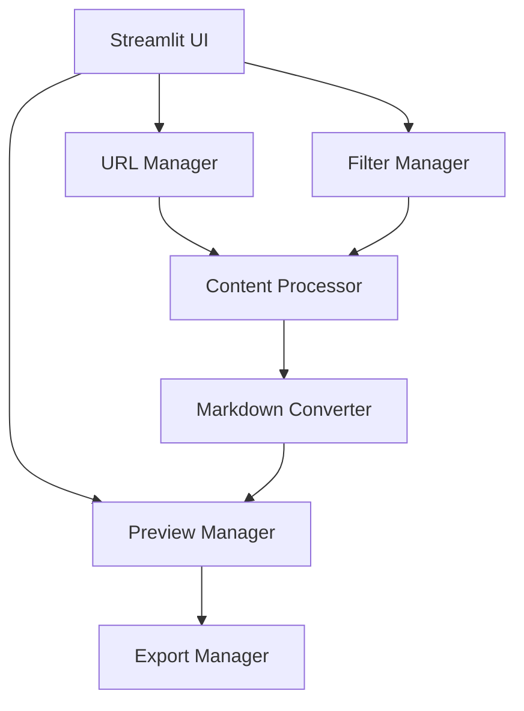

# System Patterns: Scrape2Markdown

## Architecture Overview

### Component Structure


## Core Components

### 1. URL Manager
- Handles URL collection and validation
- Maintains URL list state
- Prevents duplicate entries
- Provides batch processing capabilities

### 2. Filter Manager
```python
# Pattern: Flexible Filter Configuration
def filter_html_elements(
    soup: BeautifulSoup,
    filter_classes: list[str] | str | None = None,
    filter_elements: list[str] | str | None = None
) -> BeautifulSoup | None
```
- Supports both class and element-based filtering
- Handles single string or list inputs
- Maintains filter state
- Provides real-time filtering preview

### 3. Content Processor
- Fetches HTML content from URLs
- Implements timeout handling (10 seconds)
- Provides error handling for network issues
- Manages BeautifulSoup parsing

### 4. Markdown Converter
- Converts HTML to markdown format
- Preserves important formatting
- Handles combined document creation
- Supports clean export (URL header removal)

### 5. Export Manager
- Provides clipboard operations via pyperclip
- Generates timestamped file downloads
- Handles export errors

## State Management

### Session State Variables
```python
st.session_state.urls = []              # URL list
st.session_state.original_markdown = ""  # Current markdown
st.session_state.available_classes = []  # Available CSS classes
```

## Technical Patterns

### 1. Error Handling
```python
try:
    # Operation code
except requests.exceptions.Timeout:
    st.error("Timeout error...")
except requests.exceptions.RequestException as e:
    st.error(f"Error: {str(e)}")
```

### 2. Content Filtering
```python
# Pattern: Decompose Filtered Elements
for element in soup.find_all(tag):
    element.decompose()
```

### 3. Class Analysis
```python
# Pattern: Extract Unique Classes
def get_all_classes(soup: BeautifulSoup) -> list[str]:
    classes = set()
    for element in soup.find_all(class_=True):
        classes.update(element.get("class", []))
    return sorted(classes)
```

## Design Decisions

### 1. Two-Column Layout
- Left sidebar for controls
- Right main area for preview
- Reason: Optimizes screen real estate and workflow

### 2. Real-Time Preview
- Immediate feedback on changes
- Helps users refine filtering
- Reduces iteration time

### 3. Default Filter Elements
```python
DEFAULT_FILTER_ELEMENTS = [
    "nav", "header", "footer", "aside",
    "menu", "dialog", "sidebar", "complementary",
    "banner", "form", "input", "textarea",
    "select", "option", "button"
]
```
- Common elements that typically don't contain main content
- Configurable through UI

### 4. URL Processing
- Space-separated URL input
- Batch processing capability
- Duplicate prevention
- Reason: Simplifies bulk operations

## Future Patterns (Planned)

### 1. Intelligent URL Selection
- Context-aware URL processing
- Link-based URL discovery
- Smart duplicate detection

### 2. LLM Integration
- Content rewriting capabilities
- Enhanced filtering logic
- Markdown formatting improvements

### 3. Enhanced Validation
- Improved URL validation
- Content validation
- Format verification
